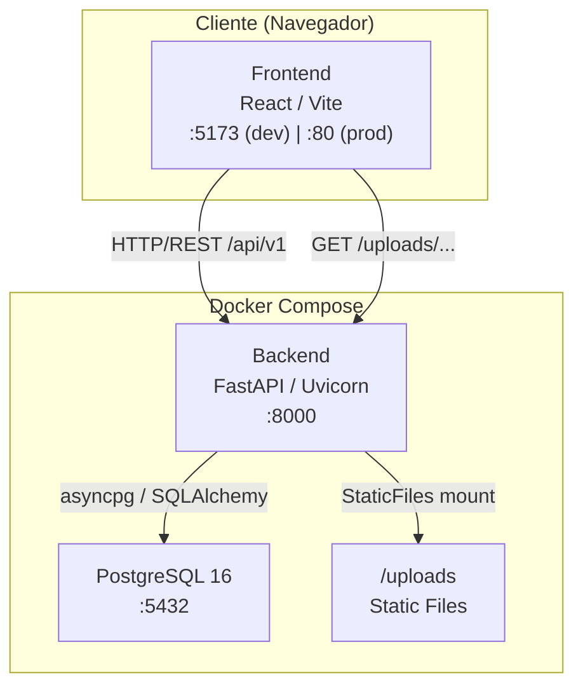
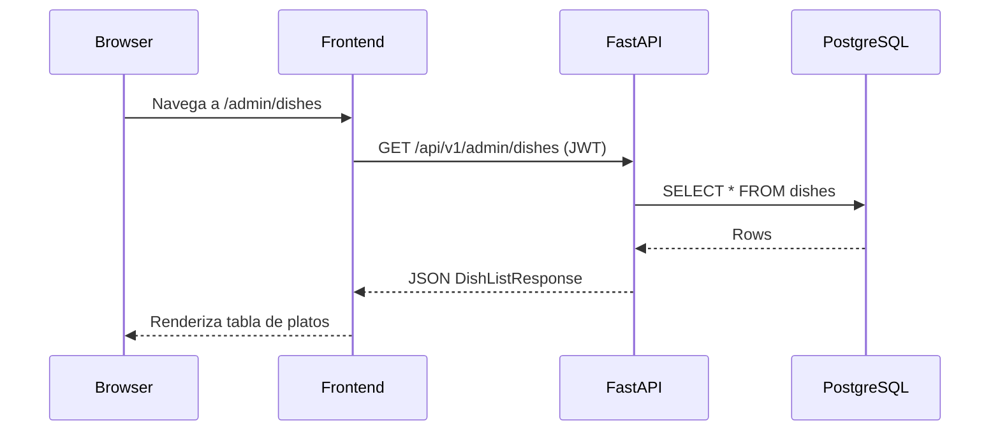
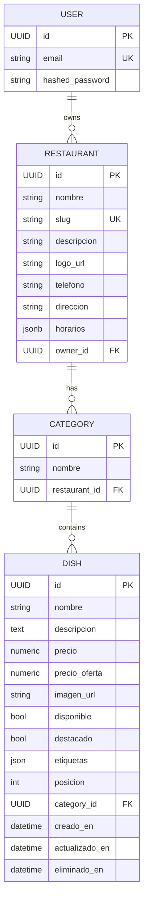

# Arquitectura del Sistema — LiveMenu

## Visión General

LiveMenu es una aplicación web de menú digital para restaurantes. Permite a los dueños gestionar su menú (platos, categorías, imágenes) y a los clientes consultarlo escaneando un código QR, sin necesidad de instalación.

---

## Stack Tecnológico

| Capa | Tecnología |
|------|------------|
| **Frontend** | React 19 + Vite + Tailwind CSS v4 |
| **Backend** | FastAPI 0.109 + Python 3.11 |
| **Base de datos** | PostgreSQL 16 (async via asyncpg) |
| **ORM** | SQLAlchemy 2.0 (async) |
| **Autenticación** | JWT (HS256, python-jose) |
| **Imágenes** | Pillow — Worker Pool (multiproceso) |
| **QR** | qrcode[pil] |
| **Infraestructura** | Docker + Docker Compose |

---

## Diagrama de Arquitectura



---

## Flujo de Petición



---

## Modelo de Datos



---

## Componentes del Backend

### `app/`
```
app/
├── api/
│   ├── dependencies.py       # get_current_user (JWT guard)
│   └── v1/
│       ├── router.py         # Agrega todos los sub-routers
│       ├── auth.py           # /auth — register, login, refresh, logout, me
│       ├── restaurants.py    # /restaurants — CRUD restaurante
│       ├── categories.py     # /categories — CRUD categorías
│       ├── menu.py           # /menu/{slug} — menú público (con caché)
│       ├── upload.py         # /upload/dish — carga de imágenes
│       ├── qr.py             # /admin/qr — generación de QR
│       └── admin/
│           ├── router.py     # /admin — agrega sub-routers de admin
│           └── dishes.py     # /admin/dishes — CRUD platos (protegido)
├── core/
│   └── config.py             # Settings (pydantic-settings, .env)
├── db/
│   ├── session.py            # Engine async, Base, GUID type
│   └── init_db.py            # Crea tablas al inicio
├── models/                   # ORM SQLAlchemy
├── schemas/                  # Pydantic input/output
├── repositories/             # Queries a base de datos
├── services/                 # Lógica de negocio
│   └── image_worker.py       # Worker Pool para procesamiento de imágenes
├── middlewares/
│   └── rate_limit.py         # 100 req/min por IP
└── workers/                  # Procesos background
```

### Worker Pool de Imágenes (CU-05)

El procesamiento de imágenes (conversión a WebP, redimensionado a 800×600) se realiza en un **pool de procesos separados** para evitar bloquear el event loop de FastAPI.

```
POST /upload/dish
    → Valida tipo (JPEG/PNG/WebP) y tamaño (máx 2 MB)
    → Encola en image_pool (asyncio.Queue, 20 slots)
    → Worker process: Pillow convierte a WebP 80% quality
    → Guarda en /uploads/
    → Retorna URL relativa
```

---

## Componentes del Frontend

```
src/
├── App.jsx                   # Router principal (react-router-dom v7)
├── pages/
│   ├── admin/
│   │   ├── DashboardPage.jsx
│   │   ├── DishesPage.jsx    # Gestión de platos (CRUD)
│   │   └── ...
│   └── public/
│       └── MenuPage.jsx      # Menú público vía slug
├── components/
│   ├── DishFormModal.jsx     # Formulario crear/editar plato + carga de imagen
│   ├── QrGenerator.jsx       # Generador y descarga de QR
│   ├── Navbar.jsx
│   └── ProtectedRoute.jsx    # Guard basado en JWT
├── services/
│   ├── api.js                # Axios instance con baseURL e interceptor JWT
│   ├── authService.js        # login, register, logout, getMe
│   ├── dishService.js        # CRUD platos + upload imagen
│   └── qrService.js          # Descarga QR
└── hooks/
    └── useAuth.js            # Estado de autenticación global
```

---

## Seguridad

| Mecanismo | Detalle |
|-----------|---------|
| **JWT** | HS256, expira en 30 min (configurable) |
| **Rate Limiting** | 100 req/min por IP (middleware propio) |
| **CORS** | Origen permitido configurable vía `BACKEND_CORS_ORIGINS` |
| **Soft Delete** | Los platos nunca se eliminan físicamente (`eliminado_en`) |
| **Contraseñas** | Bcrypt via passlib |

---

## Puertos (Docker Compose)

| Servicio | Puerto host | Puerto contenedor |
|----------|-------------|-------------------|
| Frontend (Nginx) | 5173 | 80 |
| Backend (Uvicorn) | 8000 | 8000 |
| PostgreSQL | 5432 | 5432 |
